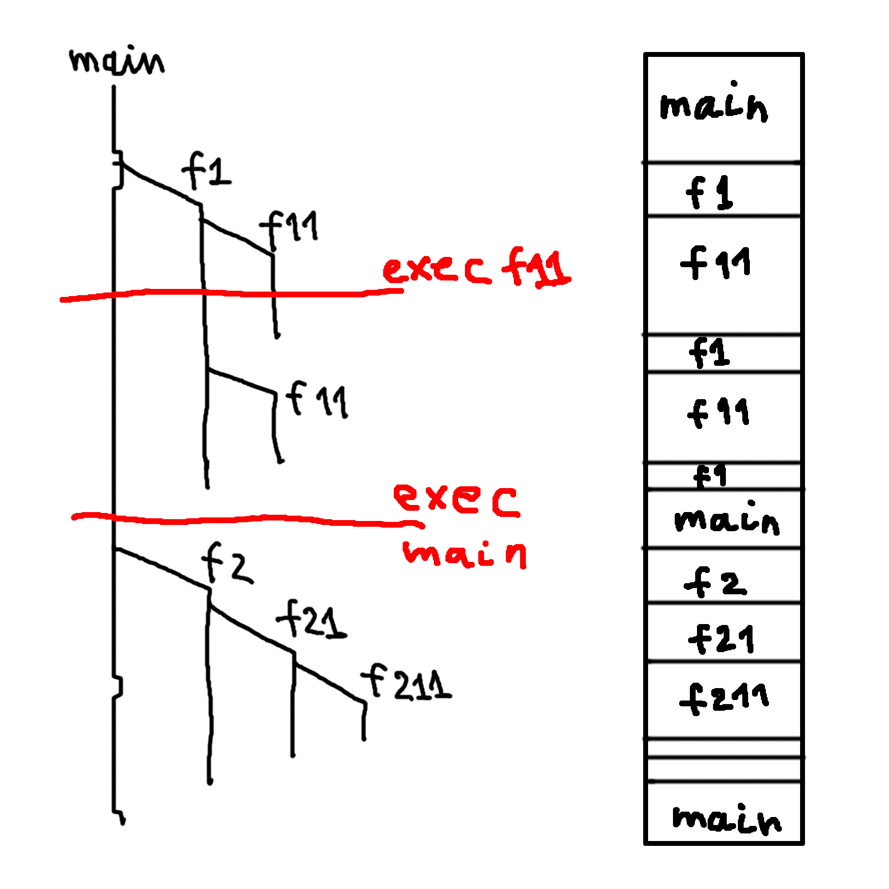

# Rust Memory Management Summary after passing Rust Book and Rust Async Book.

Hi Everyone!

For those who know Rust I will not expose something new. Just a retell of the same ideas from a different angle as I see them.
First part is my story about how I was writing a proxy server and got an issue and my battle with that. Second part is a summary about Rust Memory Management.

After reading a book or a documentation it can take a time before you get a clear vision of key ideas and summarize it in your head. Each point that you read can be clear itself, but building a system view may require a time. But when you understand it all together, it can look very easy.

One of the best ways to understand is practice. My favorite task for testing a language is writing a concurrent HTTP Server. It is a good example of a problem because it covers a lot of things. If you are not familiar It can teach you how HTTP internals works and how to work with underlying TCP protocol. And of course it is a good example to learn how to write concurrent code. Because it is a good example it is shown in the end of both books ("sync" and async ways). So I picked up another task writing a simple TCP proxy server. It is also a good example to practice with concurrency. When I learned Golang eight years ago I used the same way. But Golang was designed to be a very simple language (thanks Rob Pike and Co) so it gave me more options to focus on learning technology (Net, Concurrency) than spend time to understand language itself. But now the opposite situation. I have good knowledge of how to implement net protocols and proxies. So I focused on language and tools that it provides to help me to solve tasks.

Actually, writing a simple TCP proxy is very easy. It takes just 50-100 lines of code (can be less). The properly parameterized version (with set timeouts, buffer sizes, liveness check, etc) can take a little bit more lines of code. I implemented an asynchronous version using async-std lib. But when I started writing code I got an issue with Rust compile time memory check (of course :)). I knew what the problem was (the compiler explicitly told me about that) but I didn't know how to resolve it. That problem and searching on the internet and solutions that I found triggered me to revisit/rethink how Rust implements memory management on compile time. That story about that.

Briefly about proxy.\
A TCP proxy accepts connections from clients and establishes connections to a server (in Rust connection is a TCPStream object, when I say object I mean it in very general form, object is any data representation in memory). A TCP stream is bi-directional so a Proxy should simultaneously forward two streams of bytes one from client to server and another one from server to client.

The issue (there was no issue in general, the issue was just for me).\
In short, for each TCPStream (client and server) I need to call simultaneously read and write methods. One method (read) in one forwarder thread and another method (write) in another forwarder thread (thread in general form, os or async does not matter). Both read/write implementations of AsyncRead/AsyncWrite traits (interface) for TCPStream require a mutable reference to a TCPStream object. But as we know borrowing rules of Rust do not allow two mutable references at the same time for the same object. And from that moment my brain is overflowed with various combinations that I iterated in the head to find a solution. I found later that the solution was presented in one of the last chapters of the async-std book but without explanation so I didn't notice it when I read.

Let's go through the code.
```rust
// I skip details of etablish connection
// type of TCPStream is async_std::net::TcpStream
let mut client_stream: TcpStream = get_client_connect();
let mut server_stream: TcpStream = get_server_connect();

// forward from client to server one way
let _res = io::copy(&mut client_stream, &mut server_stream).await; 
```
I have two TcpStreams. How we see forward bytes is very easy. But I need bi-directional forwarding.
```rust
let mut client_stream: TcpStream = get_client_connect();
let mut server_stream: TcpStream = get_server_connect();

// forward bi-directionally
let _res = try_join!(
    io::copy(&mut client_stream, &mut server_stream),
    io::copy(&mut server_stream, &mut client_stream),
);
```
Now I have a problem. Borrow checking says I am trying to create a second mutable reference for server and client streams.

The first thing I considered was the idea to use mutex. If You need multiple mutable access Rust Book introduces Mutex for that (actually multiple references are provided by Arc smart pointer, mutex just guarantees exclusive access each moment of time). That raised my first questions: Why does async-std not provide TCPStream with that functionality? Why do I need to implement it myself or Do I think the wrong way? Yes, I thought in the wrong way. I realized that Mutex can not help in that case. Read and Write methods are blocking (internal implementations are not blocking but APIs exposed by the library are blocking) so if one thread acquires a mutex lock for instance for read operation and is blocked on read then another thread will be blocked on waiting lock for write operation. So we can not read/write simultaneously :(. Actually there is no need for mutex, the solution of the problem looks different but that is an example of how my thoughts flowed.

Ok. Then I thought about trying to use non-blocking read/write. Maybe the library provides non-blocking methods and I can just in loop read and write and emulate simultaneous behavior. No library didn't provide that and I didn't have a plan to implement it myself. I started thinking that it looks like I bad understand Rust.

Last idea was to use a clone before I jumped to search on the internet. If I can not use mutable references then it looks like I have only one option to clone the TCPStream object itself. I didn't start with that option because TCPStream is a complex object and cloning complex objects can be expensive. Second reason was that I didn't know the internals of the implementation of TCPStream, I never before worked with sockets on a low level and how a language interacts with an OS. So for me it was not clear how cloning would work. Will it be a shallow or deep copy? If TCPStream works with socket does it somehow point to it? If two objects have pointers to the same object (socket) will I have again issue with two mutable references? Does TCPStream internals have mutable references? Will cloning be thread safe? Although my problem is more related to how the language works with the OS and sockets at that moment I realized that for me it was not clear how Rust works with custom complex data if the internals have mutable references and I needed to revisit the subject of how Rust memory management works. Also I looked at TCPStream documentations of the Rust std lib and the std version provides try_clone method but async-std does not. This also raised doubts in me. And I went looking for an answer on the Internet.

I found that people on the internet asking the same question, their thoughts went from the same steps that my. I am not alone. 

There were two solutions. One to use clone and second see code below.
```rust
let (reader, writer) = &mut (&stream, &stream);
```
The second solution absolutely was not clear for me.

Let's start from first. People in internets say that async TCPStream is just wrap to std TCPStream and std version is just wrap to socket file descriptor. Both TCPStream versions do not mutate internal states and do not require to be mutable. Mutability is just a constraint of AsyncRead/Write traits, because some other implementations can require mutability. Also they do not have internal mutable objects that can make not easy cloning. Thread-safeness of sockets guaranteed by OS. So I can clone. All clear, excluding the fact that documentations do not provide that details.

From my vision, good documentation (for example like Golang std docs) should explicitly provide information (some contract) on how to use code and information about edge-cases. If your code builded and run it does not mean it works correctly. Understanding edge-cases is very important if you write reliable code. Of course there should be some balance, you can not write an essay in a documentation.

You can say just try clone and if code compiles it means that object implemented Clone trait and it is your contract and you no need care about details. Maybe.

I decided to check that all works how people say. I cloned async-std and rust repositories and dived into code. The Rust development tools are great (thanks to the Rust community for this). Everything works without any actions from my side (ok rust repo requires run x check, but it is a very small action). Just clone repo, open the project in vscode and voila all code navigation works perfectly. I enjoyed learning the code. Ok I can use cloning.

What about the second option? Cloning works but is there a better solution? Solution two can be re-written in the next form.
```rust
let reader = &mut &stream;
let writer = &mut &stream;
```
So now instead of two mutable references to TCPStream we have two mutable references to references to TCPStream. Each &stream is different objects pointing to the same TCPStream object, but it is different objects so each &mut now point to a different &stream-s so we do not have twice mutable reference to the same object. But you can say is it not the same problem? No, because we have access via two mutable references using intermediate immutable references and so we can not modify the object so there is no problem for the compiler. As I mentioned above we do not need to modify TCPStream, we need mutable reference just for matching trait constraint. The TCPStream implements read/write traits for both types TCPStream and &TCPStream that is why this solution works.

### Some of Summary of Rust Memory Management
This is a short summary showing key ideas of Rust Memory Management and its compile time correctness validation.

Below list of some operations with memory. This is a small part of what Rust provides. But this is enough to show the main ideas.
```rust
let a = 42; // create int object
let s = String::from("qwerty"); // create String object
let acp = a; // copy a
let smv = s; // move s
let mut scl = smv.clone(); // clone s
let smvr = &smv; // immutable reference to s
let smvr2 = &smv; // second immutable reference to s
let sclrm = &mut scl; // mutable reference to clone of s (scl)
```

To explain these operations let's first start from how in general a program code works.

We start from single thread code. Program code organized with splitting to functions. Evolution of functions call follow stack model (call-stack). If we look for a timeline of that stack evolution we will get a call tree (see image below). It might look weird but if you keep in mind that each moment of time executed only the rightest branch everything will fall into place. Also look at the right bar showing only the currently executed function.



As we see the lifetime of functions is absolutely predictable and controlled by the compiler. Relations of functions lifetimes are also very straightforward. A child function's life is always shorter than parents and located inside of the parent's timeline.

Functions manipulate data, so what about the lifetime of data used by functions? For storing data the function uses abstraction of the variable. Each function has its own variables. Lifetime of variable same as lifetime of its function. We assign value (object in memory) to variables using `=` (or passing as argument to funсtion). When we do assign operations we add data to stack memory (of function). If the size of data is known at compile time we can put the entire object to stack.
```rust
let a = 42;
```
If size dynamically changes on runtime or is not known at compile time we put our value's main object to heap and put some fixed size object to stack pointing to object in heap.
```rust
let s = String::from("qwerty");
```
Internals of each data type using the heap can vary from type to type. But we always need some data in the stack for pointing to data in the heap.
If our data is stored only in the stack there is no problem. Compiler no need to take special action, all data in stack clean when function ends.
If data is stored in the heap, the compiler can easily track those cases using a pointer stored in the stack and add some code to clean data in the heap when the function ends (drop trait).
